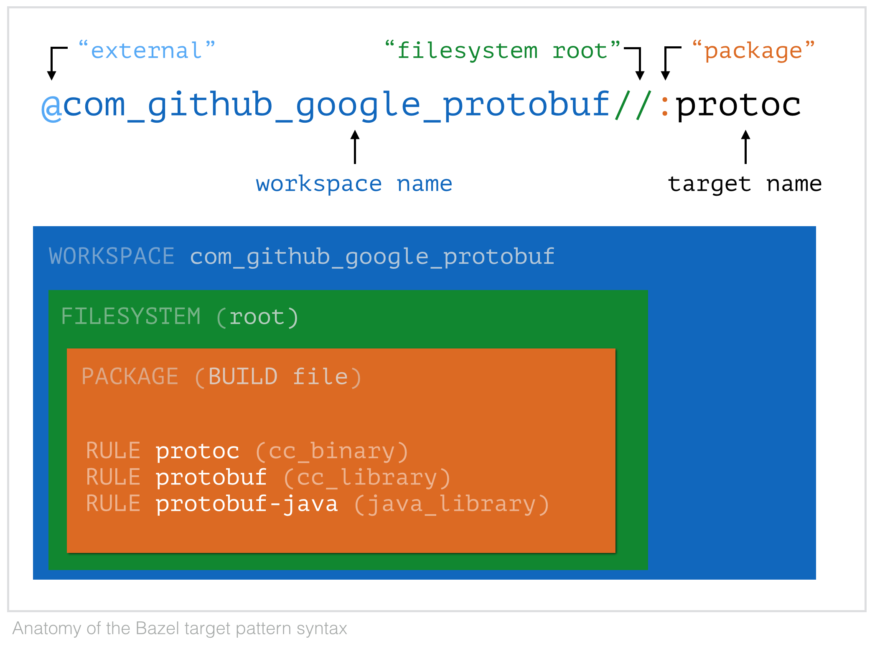

## build dev container

```bash
podman build \
  --no-cache \
  -t dev-env \
  -f Dockerfile.dev
```

```bash
podman run \
  --name dev \
  --rm \
  -d \
  -p 2222:22 \
  -v .:/repo \
  dev-env
```

```bash
podman kill dev
```

## generate `BUILD` for go/python projects

```bash
bazel run //:gazelle_go
bazel run //:gazelle_py

# specific dir
bazel run //:gazelle_go -- dir1 dir2
bazel run //:gazelle_py -- dir1 dir2
```

## sync bazel with go.mod

```bash
# create `deps.bzl` if it doesn't exist
touch deps.bzl

bazel run @io_bazel_rules_go//go -- mod tidy
bazel mod tidy
bazel run //:gazelle_go
```

## update python dependencies

```bash
# create `gazelle_python.yaml` if it doesn't exist
touch gazelle_python.yaml

micromamba --yes create python=3.12 \
  --channel conda-forge \
  --file requirements.txt \
  --name tmp

micromamba activate tmp

micromamba update --all --yes

pip list --format=freeze > requirements.txt

micromamba deactivate

micromamba --yes env remove --name tmp

# update requirements_lock.txt
bazel run //:requirements.update

# update gazelle_python.yaml
bazel run //:gazelle_python_manifest.update

# update python BUILD files
bazel run //:gazelle_py
```

## build

```bash
# build all
bazel build //...

# build a target (e.g. cpp_server)
bazel build //cpp_server
```

## run

```bash
# run a target
bazel run //cpp_server

# or

# run binary manually
./bazel-bin/cpp_server/cpp_server
```

## clean

```bash
bazel clean --async

# --expunge: removes the entire working tree and stops the bazel server
bazel clean --expunge

# linux
sudo rm -rf ~/.cache/bazel

# mac
sudo rm -rf  /private/var/tmp/_bazel*
```

---

## known issues

- `py_proto_library` doesn't work on mac

---

#### bazel target pattern syntax

https://grpc.io/blog/bazel-rules-protobuf/#13-target-pattern-syntax


